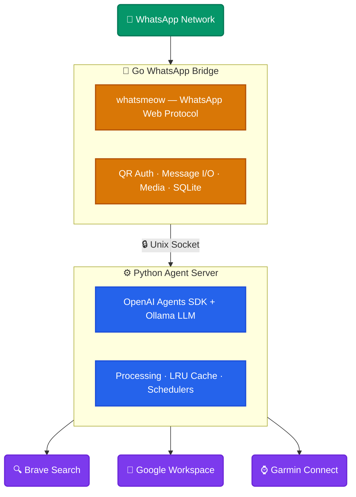

Imagine an assistant that lives in your WhatsApp—handling ChatGPT-style queries, searching the web, managing your calendar, reading your emails, tracking your fitness, and reminding you of important tasks. Now imagine this assistant runs **entirely on your machine**, costs **zero dollars** in API fees, and keeps your data **completely private**.

That's Leo. See it in action here:

[VIDEO DEMO PLACEHOLDER - YouTube link to be added]

## Why I Built This

I already use WhatsApp to connect with family and friends—it's the most popular messaging app on the planet. What if I could manage my digital life on the same surface?

I also wanted:
- **Privacy first**: My data never leaves my machine
- **Control**: I maintain the logic for workflow, system prompts and model choice.
- **Zero recurring cost**: No API subscriptions, no token metering
- **Learn by building**: A real project to deepen my understanding of local LLMs and agents

Leo is the result.

## What Leo Can Do

### Intelligent Conversations

Leo handles all the usual AI assistant tasks—answering questions, brainstorming, deep reseach, explaining concepts—powered by a local LLM.

### Web Search

Need current information? Leo connects to Brave Search to pull real-time data. Ask about news, look up facts, research topics—all without leaving your primary chat app.

### Google Workspace Integration

Leo becomes a productivity powerhouse with wide ranging capabilities though google integration:

| Service             | Capabilities                                       |
| ------------------- | -------------------------------------------------- |
| **Google Calendar** | View events, create meetings, find free time slots |
| **Gmail**           | Search threads, draft and send emails              |
| **Google Docs**     | Create, read, find, update documents               |
| **Google Drive**    | Search files, create folders, download content     |
| **Google Sheets**   | Read data, get ranges                              |
| **Google Slides**   | Read presentations                                 |

### Health & Fitness

Leo connects to Garmin Connect to access your fitness data—sleep patterns, training schedule, workout history, performance trends. This powers personalized health insights in your briefings.

### One-Time Reminders

Never forget anything. Use natural language:

```
#remindme in 30 minutes to call mom
#remindme tomorrow at 9am to check emails
#remindme at 5pm Feb 25, 2026 to submit the report
```

Leo parses your request intelligently and messages you at the right time.

### Recurring Reminders

Build better habits:

```
#reminder add "9pm Sun to Thu" Review and adjust tomorrow's calendar
#reminder add "12:30 pm Thursdays" Readup Weekly Review Doc
#reminder list
#reminder remove <id>
```

### Scheduled Briefings

This is where Leo shines. Create automated briefings that deliver exactly what you need, when you need it. You effectively control the prompt and it's execution schedule:

```
#briefing add "Morning Brief" "6:00am everyday" Get today's scheduled traning from Garmin, today's calendar events, and unread emails summary
#briefing add "Evening Brief" "5:00pm everyday" Get unread emails summary and top 2 news from today
```

Wake up to a personalized digest—delivered right to WhatsApp.

### Web search and google

```
@leo, am I fee this Sat 5pm? if so add 2 hr block for Tom's bday

#leo, what's the latest supreme court ruling on Tariffs?

@leo, do a deep research and summarize if Tarrifs are good or bad for US economy
```

## Why Zero Cost Actually Works

Here's the breakdown:

| Component | Cost |
|-----------|------|
| LLM (Ollama + local model) | $0 |
| WhatsApp messaging | $0 (uses WhatsApp Web protocol) |
| Brave Search (free tier) | $0 |
| Google APIs | Free |
| Garmin data access | Free |
| Hosting | $0 (runs locally) |
| **Total** | **$0/month** |
My best estimates to electricity costs tend towards less than $10/ year. 
* Incremental for running service ~0W
* Spikes during inference- 100w to 300w for a few seconds on 5070 Ti.
* 5060 Ti is slower but even more efficient 

The key insight: **modern open-source LLMs are good enough** for most assistant tasks. Models like GLM-4.7-Flash, gpt-oss:20b, and deepseek-r1:8b run on consumer hardware and deliver excellent results without per-token costs.

You already own the hardware, make it work for you :) 

## The Privacy Advantage

Leo runs entirely on your local machine:

- **Local LLM**: Powered by Ollama, inference happens on your GPUs
- **Local Storage**: Messages, reminders, and sessions live in SQLite databases on your device
- **No Cloud Dependency**: Your conversations never travel to external servers beyond WhatsApp
- **Your Data, Your Control**: Google, WhatsApp and Garmin tokens stay on your hardware

## Technical Architecture



@[excalidraw](arch.excalidraw)

### Key Components

**Go WhatsApp Bridge** (`whatsapp-mcp/whatsapp-bridge/`)
- Built on `whatsmeow` - a Go library implementing WhatsApp's multi-device protocol
- Heavily modified for performance and to support all Leo usecases
- Handles authentication via QR code scanning
- Manages message storage in SQLite
- Processes media uploads/downloads (images, videos, audio, documents)
- Includes custom Ogg Opus parser for voice message duration detection

**Python Agent Server** (`agent/`)
- Uses OpenAI Agents SDK for orchestration
- Connects to Ollama via OpenAI-compatible API (`http://localhost:11434/v1`)
- Agent factory with LRU cache (max 20 agents, 30-minute TTL) for multi-conversation support
- Natural language time parsing for reminders using an LLM agent
- Cron-based scheduling for briefings and recurring reminders

**MCP Servers** 
- `brave-search-mcp`: Web search capabilities
- `workspace-mcp`: Google Workspace integration (Docs, Calendar, Gmail, Drive, Sheets, Slides)
- `garmin-mcp`: Fitness and health data

### Operating Modes

Leo supports two modes:

1. **Dedicated Number Mode** (`IS_DEDICATED_NUMBER=true`): Responds to all DMs and group mentions—perfect if you have a dedicated phone number for Leo

2. **Mention Mode**: Only responds when explicitly mentioned (`@leo` or `#leo`)—works with your existing WhatsApp account

### Security Considerations

- Unix domain sockets for inter-process communication (no network exposure)
- Allowed senders whitelist for access control
- Thread-local SQLite connections to avoid concurrency issues
- Environment-based configuration for sensitive credentials

## Interesting Technical Details

### Natural Language Time Parsing

The reminder system uses an LLM agent to parse times from natural language. Instead of rigid regex patterns, Leo understands:

- "in 30 minutes"
- "tomorrow at 9am"
- "at 5pm Feb 14, 2026"
- "next Monday morning"

### Cron-Based Scheduling

Briefings and recurring reminders use `croniter` for flexible scheduling:

| Input | Cron Expression |
|-------|-----------------|
| "9am everyday" | `0 9 * * *` |
| "Monday 8am" | `0 8 * * 1` |
| "5pm friday" | `0 17 * * 5` |

### WhatsApp LID Resolution

WhatsApp uses LID (Linked ID) for privacy—a format that can't be used for sending messages. The Go bridge automatically resolves LID to actual phone numbers for outbound messages.

### Performance Optimizations

- **Agent caching**: LRU eviction prevents memory bloat from idle conversations
- **Pre-built MCP parameters**: Avoids per-message object creation overhead
- **Shared environment copy**: Avoids copying 100+ environment variables per request
- **Singleton OpenAI client**: Reused across all messages

## Getting Started

_I built this on Ubuntu with nvidia gpus, but should work just the same on Mac and WSL_

1. Clone the repository
2. Install Ollama and pull a model: `ollama pull glm-4.7-flash`
3. Configure your `.env` file with Brave Search API keys and settings
4. Run the services: `./start_services.sh`
5. Scan the QR code to connect WhatsApp
6. Start messaging Leo

## What's Next

Leo is already useful, but there's more to explore:

- **Long-Term memory**: Remember preferences, recall conversations from past
- **Multi-modal capabilities**: Image analysis, document understanding
- **Voice improvements**: Better TTS/STT for seamless voice conversations
- **RAG on personal data**: Index and search through your own documents
- **Family/shared mode**: Multiple users with separate contexts

## The Bottom Line

Leo represents a shift in how we think about AI assistants:

- **Own, don't rent**: Your hardware, your model, your rules
- **Privacy by design**: Data never leaves your machine
- **Zero marginal cost**: Chat all day, run 50 briefings—costs nothing extra
- **Meet users where they are**: WhatsApp is already in everyone's pocket

You don't have to choose between convenience and privacy. With Leo, you get both.

---

*Leo is open source. Your assistant, your data, your control.*


@[youtube](NZ1mKAWJPr4)